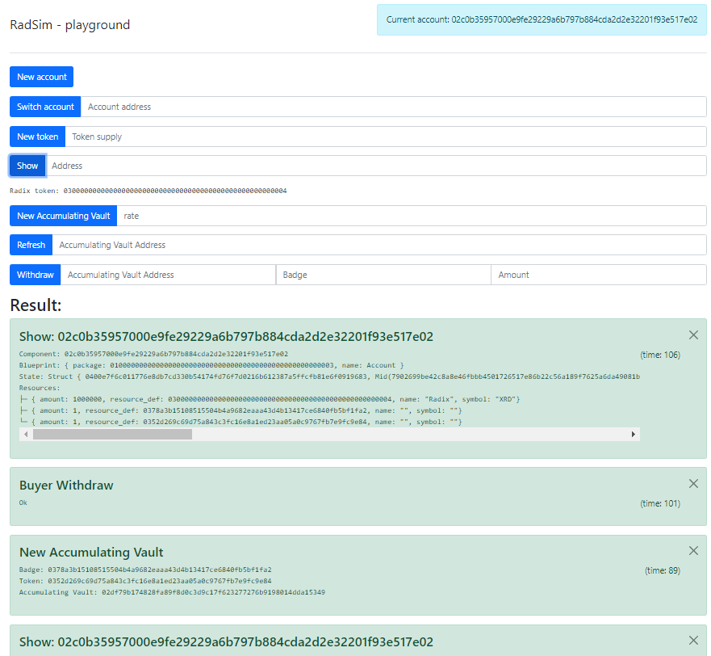

# radsim

Node.js server which wrap the radix simulator

# installation

you need to have https://github.com/radixdlt/radixdlt-scrypto installed

install **radsim** with `npm install`

launch it with `node app.js 8080 <path to your blueprint>`

as an example, you can use https://github.com/croquelois/scryptoAccumulator the web client is tuned for this blueprint, but is easily adapted to other blueprint

you can now access it via your browser on port 8080

# Server side

the server side try to achieve maximum flexibility

all the endpoint are `post` type, mainly to speed-up the dev of this tool.

all endpoint return a json with at least the `epoch` field inside, if there is an error the field `error` will be present also

most endpoint will set the default account if the field `currentAccount` is provided in the message body

- `/new-account`
- `/new-set-default-account` it read `body.addr`, but you usually don't need this endpoint, because each endpoint will set the account provided (if any)
- `/addr/:addr` return the detail about the object at the address provided, it will be in text format in the `out` field
- `/addr` show the full ledger
- `/new-token-fixed` create a token with `supply` amount of token given to current account
- `/call-function/:blueprint/:fctName` the field `args` is used and provided to the simulator, the output of simultor is parsed and addresses of resources created sent to the client
- `/call-method/:component/:methodName` the field `args` is used and provided to the simulator, the output of simultor is parsed and addresses of resources created sent to the client

# Limitation

when restarted it lose the ledger

some simulator commands are not implemented yet (mint, transfer, new-token-mutable, new-badge-*)

there is no security at all

